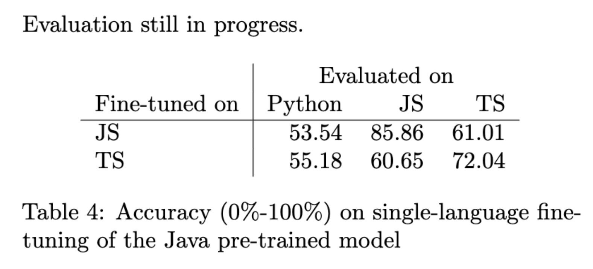
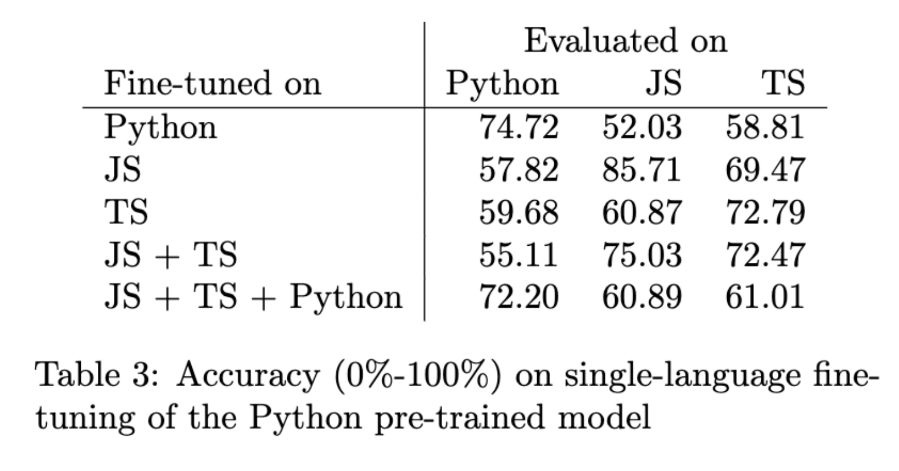

# Group 6 -- Code Completion (token level)


Here is the introduction and pipeline for token level code completion task.

## Task Definition

Predict next code token given context of previous tokens. Models are evaluated by token level accuracy.

Code completion is a one of the most widely used features in software development through IDEs. An effective code completion tool could improve software developers' productivity. We provide code completion evaluation tasks in two granularities -- token level and line level. Here we introduce token level code completion. Token level task is analogous to language modeling. Models should have be able to predict the next token in arbitary types.

## Download links to our datasets and models
### Datasets
If you want to do it yourself from scratch, without docker (docker also reproduces these), take a look at [entrypoint.sh](entrypoint.sh).
Do not execute this file directly, it's made to be run by docker, but it should provide enough information for you to do this locally.

The datasets for `py150` and `javaCorpus` are not created by us, [follow these steps](https://github.com/microsoft/CodeXGLUE/tree/main/Code-Code/CodeCompletion-token#dataset) to download and preprocess those datasets.
Our datasets can be found here, they should be saved as is in the `dataset` folder, they should override the files in the folders you have locally, if you have already downloaded the datasets.
* [Pre-processed and tokenized JavaScript dataset](https://drive.google.com/file/d/1O_F_6YFZYzpn4S__vHWd27_ZK8mVVzlx/view?usp=sharing)
* [Pre-processed and tokenized TypeScript dataset](https://drive.google.com/file/d/1RqcvAIh7WACZpKDe1-oMxhg-d2rk8zVk/view?usp=sharing)

### Pre-trained models
Download these zip files, and extract their contents as is to the `save` directory.
The below files are for the single language models.

* [Pre-trained on Python, fine-tuned on python](https://drive.google.com/file/d/1uLFPrNgE1h7VjB-KUpwCuaRP61aaGb8R/view?usp=sharing)
* [Pre-trained on Python, fine-tuned on JavaScript](https://drive.google.com/file/d/1NpP4wdGxwnK6PbFZ90UePFD3g53c1zU_/view?usp=sharing)
* [Pre-trained on Python, fine-tuned on TypeScript](https://drive.google.com/file/d/1fbreN-qZeG2LvViKAlgE_N3esce-WwnY/view?usp=sharing)
* [Pre-trained on Java, fine-tuned on JavaScript](https://drive.google.com/file/d/1S-T-ZFkmA5uTvn7hkfsWkfK9uPqMcgwB/view?usp=sharing)
* [Pre-trained on Java, fine-tuned on TypeScript](https://drive.google.com/file/d/1C1dzx0_iPK_m9HjKI92bvLBohtcedaR3/view?usp=sharing)
* [Pre-trained on Python, fine-tuned on JavaScript then TypeScript](https://drive.google.com/file/d/1w6kmN1GXu_eyqRyHnMSEIATfsqqW0jEn/view?usp=sharing)
* [Pre-trained on Python, fine-tuned on JavaScript then TypeScript then Python](https://drive.google.com/file/d/1KB7-7vJBWthbPyuPs2k03SjD3sojbyiP/view?usp=sharing)


## Docker
Use these steps to easily run the code in a docker container.

## Prerequisites

- Install NVidia drivers from [here](https://www.nvidia.com/Download/index.aspx?lang=en-us)
- Install docker
- Make sure `nvidia-container-toolkit` is installed
- Any nvidia driver issues are left as an exersise to the reader

#### Dataset
Build dataset creator with the following command: (this is quick)
> ```docker build -t dataset -f dataset.Dockerfile .```

Run dataset collector with the following command: (this is slow, like really slow)
If you see the following lines:
```text
...
data/despawnerer/summarize/summarize/
data/despawnerer/summarize/summarize/__init__.py
data/despawnerer/summarize/summarize/language.py
data/despawnerer/summarize/summarize/summarize.py
data/despawnerer/summarize/setup.py
```
It's not stuck! It's just running the tokenizers.

> `docker run --mount type=bind,source="$(pwd)"/dataset,target=/dataset dataset`

#### Training

Build the training image with the following command where `CUDA_VERSION` can be one of `cu116, cu113, cu102, cpu`: (this is quite slow)
> `docker build -t token_completion . --build-arg CUDA_VERSION=[CUDA_VERSION]`

Run the trainer with the following command where `MAKE_TARGET` is a target from [Makefile](Makefile): 
> `docker run --gpus all --mount type=bind,source=$(pwd)/dataset--mount type=bind,source=$(pwd)/save,target=/save,target=/save --mount type=bind,source=$(pwd)/logs,target=/logs token_completion [MAKE_TARGET]`

Or run everything we got!

> `docker run --gpus all --mount type=bind,source=$(pwd)/dataset--mount type=bind,source=$(pwd)/save,target=/save,target=/save --mount type=bind,source=$(pwd)/logs,target=/logs --entrypoint bash token_completion [eval-all.sh | run-all.sh]`

#### Expected results

In order to read the results, if everything went well, you can find them in the last row of the respective log file in the `logs` folder.




